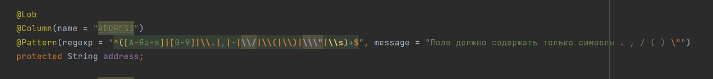

# Achievements

## № 894 Проверка на лишние символы
27.02.2023 - 05.03.2023
### Задача:

1. Сделать проверку, чтобы в текстовые поля в базу НЕ сохранялись никакие символы
2. Если в текстовом поле есть символ переноса строки, то заменять его на пробел
3. Очистить базу от таких символов в полях и сущностях 
    * Разрешенные символы: 

    **.   ,   /   "   -   (   )**  символы кириллицы и цифры

#### Решение:

###### 1. 

Очень помогла статься по regex 

<https://habr.com/ru/post/545150/>

Написал регулярное выражение, к первому заданию:

    @Column(name = "ADDRESS")
    @Pattern(regexp = "^([А-Яа-я]|[0-9]|\\.|,|-|\\/|\\(|\\)|\\\"|\\s)+$", message = "Поле должно содержать только символы . , / ( ) \"")
    protected String address;

    

###### 2. 
Проконсультировался с Алексеем, решил использовать сеттер для реализации требования и написал решение по второму заданию. По итогу любое количество пробельных символов >1 и любое количество переносов будут заменяться на 1 проблел:

     public void setAddress(String address) {
        address = address.replaceAll("\\n|\\s{2,}", " ");
        this.address = address;
    }
    

#### Дополнительно

* Научился пользоваться git:
    * отвел ветку от develop
    * залил комит
    * Важно отводить ветку и в ее названии использовать номер задачи, в комитах тоже самое.

Статья:
<https://rustycrate.ru/%D1%80%D1%83%D0%BA%D0%BE%D0%B2%D0%BE%D0%B4%D1%81%D1%82%D0%B2%D0%B0/2016/03/07/contributing.html> 

